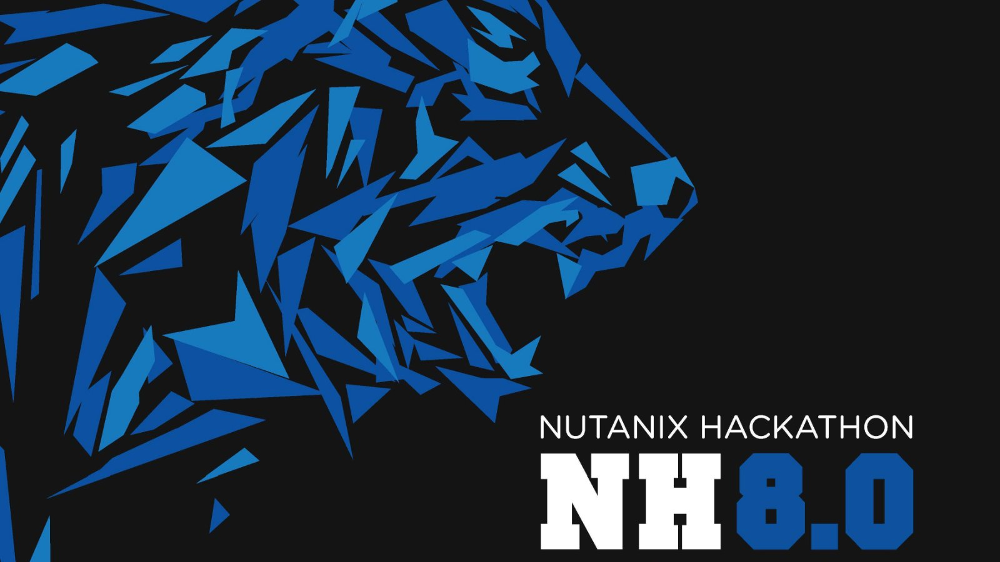

## Purpose

This project aims to develop an application to extract a personal identifiable information (PII) from a text file or an input text. 

## Big Picture 

* In 2020, enterprises lost $21 B from Ransomware. 
* Every 11 s, there is a ransomware attack. 
* Ransomware attacks are growing 7x each year.

## Ransomware and PII

Ransomware is an ever-evolving form of malware designed to encrypt files on a device, rendering any files and the systems that rely on them unusable. Malicious actors then demand ransom in exchange for decryption. Ransomware actors often target and threaten to sell or leak exfiltrated data or authentication information if the ransom is not paid. Essentially, `PII is the key target for ransomware attackers.`

## Problem Statement
 U.S. DEPARTMENT OF LABOR defines PII as a representation of information that permits the identity of an individual to whom the information applies to be reasonably inferred by either direct or indirect means. Essentially, PII is defined as information that directly identifies an individual. The examples of PII includes: 

* Name
* SNN
* Credit Card
* Location
* E-Mail Address
* Domain Name
* Crypto Wallet ID
* IP Address 
* Date Time
* Bank Account Number
* US Passport Number

 The loss of PII can result in substantial harm to individuals, including identity theft or other fraudulent use of the information. With growing digitalization, the PII data are increasingly being stored and processed on cloud. Safeguarding PII information is a critical requirement for any enterprise cloud/infrastructure vendor such as Nutanix. However, `rapid growth of enterprise data volume, velocity, and variety poses security and governance risks because the traditional rule-based PII detection and maintainance methods do not scale.` That is why we are offering a deep learning based application which can quickly extract PII information from a text file or an input text.

## Impact
* Reduce the risk of data breach
* Streamline data governance

## Demo
[Demo Link](http://54.184.187.125:3000/)

## References

* https://www.cisa.gov/sites/default/files/publications/CISA_Fact_Sheet-Protecting_Sensitive_and_Personal_Information_from_Ransomware-Caused_Data_Breaches-508C.pdf

